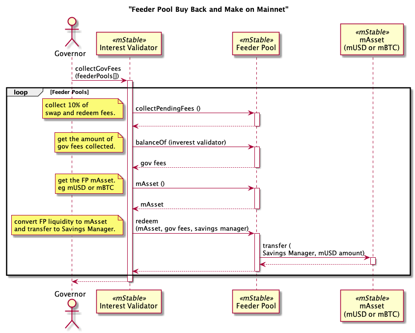

# BuyBack and Make Processes

## Feeder Pools

### Example transactions

- Collect governor fees from Feeder Pools into the Savings Manager
    - [0x789b9808cb57cc87d70571e04dcbbc6cb6157ae125a2db58f3e1993c348e983c](https://etherscan.io/tx/0x789b9808cb57cc87d70571e04dcbbc6cb6157ae125a2db58f3e1993c348e983c)
	- HBTC 0.0056 mBTC (204 USD)
	- GUSD 2,735 mUSD
	- TBTC 0.0066 mBTC (240 USD)
	- BUSD 4,070 mUSD

- Distribute unallocated mUSD and mBTC from SavingsManager to Revenue Recipient
	- [0x397e16d45b6ed2dfebfff25d9a1f9fe9f1e30cff5917af442078d5cb7755e19d](https://etherscan.io/tx/0x397e16d45b6ed2dfebfff25d9a1f9fe9f1e30cff5917af442078d5cb7755e19d)
	- 6,850 mUSD
	- 0.0124 mBTC

- Deposit mUSD and mBTC to the Balancer Pool
	- [0x08dad0a43fe00941079117bb5edc1f2bf17a6dc8d812d2b1d72690cace070614](https://etherscan.io/tx/0x08dad0a43fe00941079117bb5edc1f2bf17a6dc8d812d2b1d72690cace070614)
	- Deposited 2,235 mUSD and 0.012 mBTC into the balancer pool
	- Still has 4,661 mUSD left in the Savings Manager 