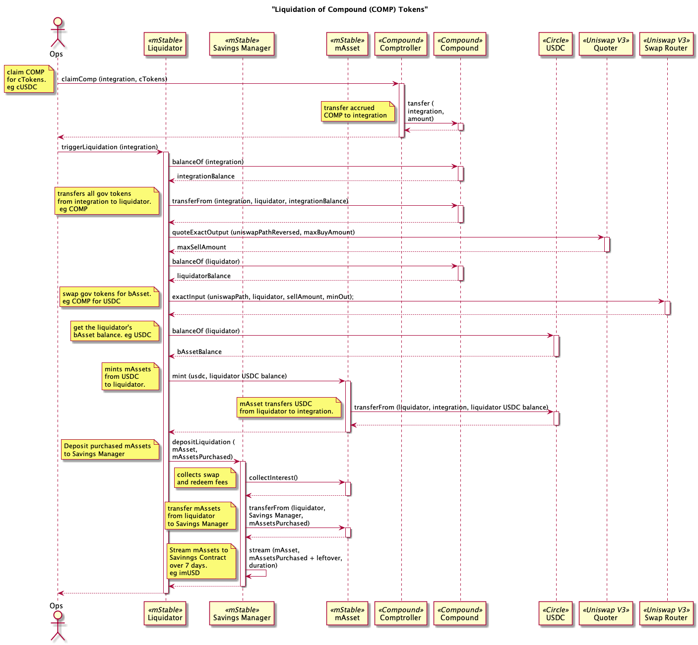
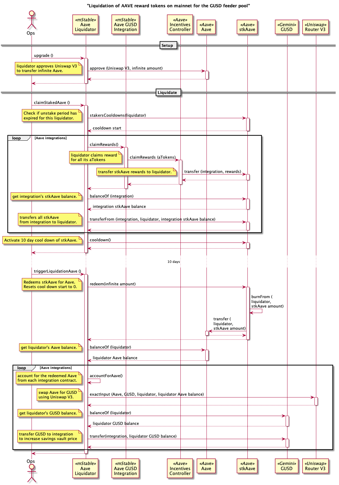
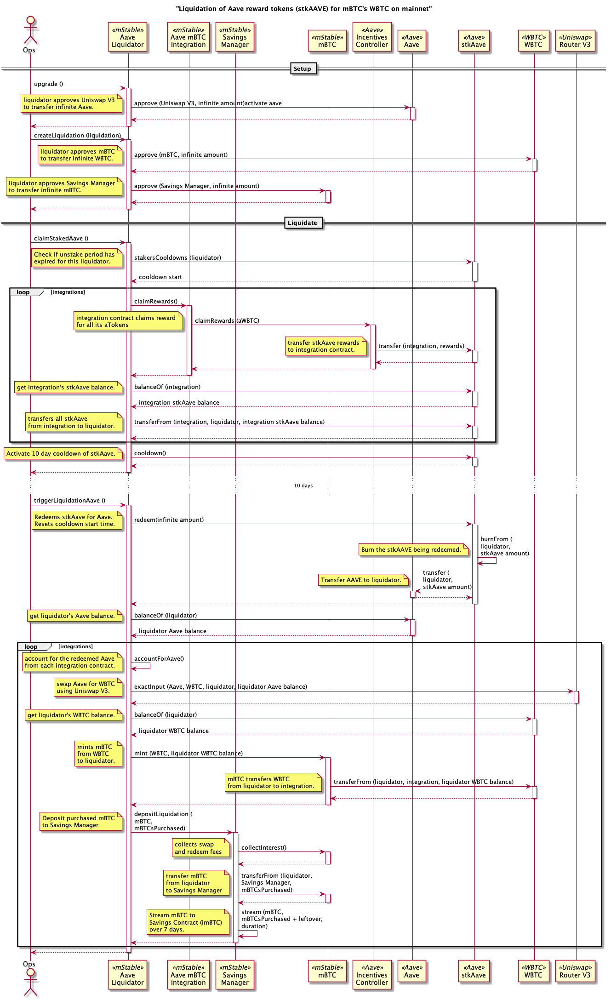
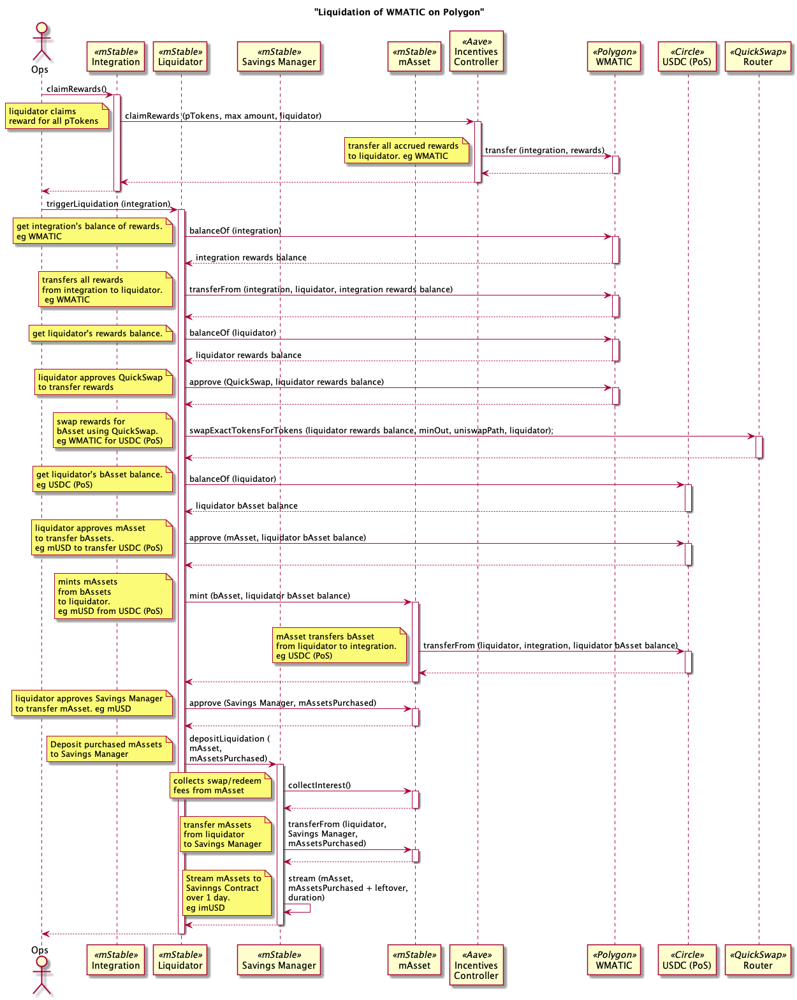
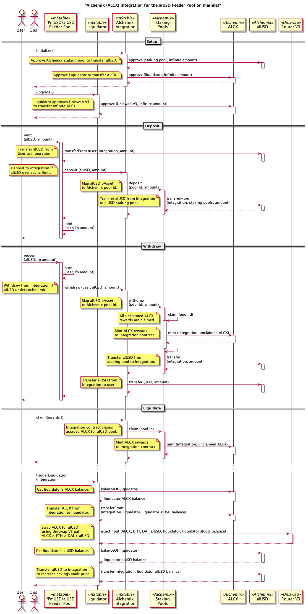

# Liquidation Processes

These liquidation process are no longer used. COMP and stkAAVE are now sent directly to the mStable Treasury and the Matic rewards on Polygon have ended.

## COMP from mUSD

## AAVE from GUSD Feeder Pool

## AAVE from mUSD

## AAVE from mBTC

## Matic from mUSD on Polygon

## Alchemix (ALCX) from alUSD Feeder Pool

