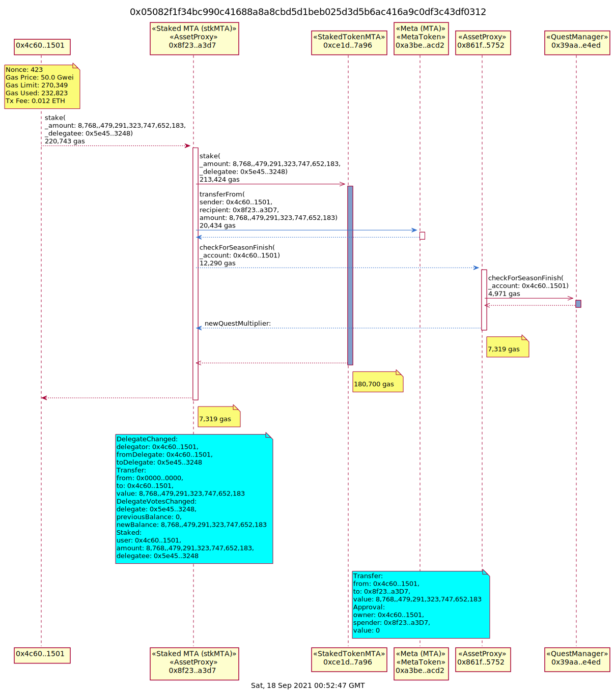
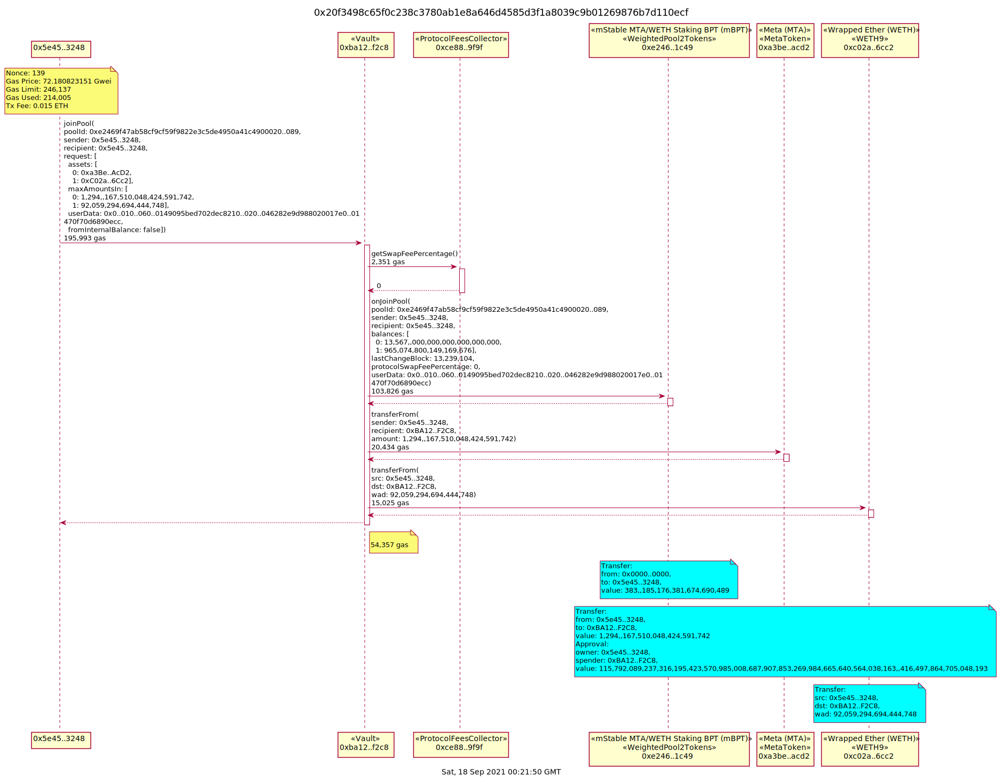
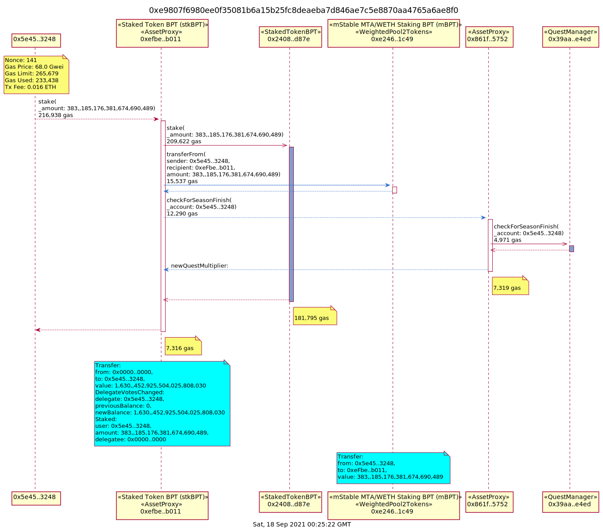

# Staking V2

User guides
* [Staking MTA](https://medium.com/mstable/staking-v2-2cd864552130)
* [Staking MTA/ETH Balancer Pool Token](https://medium.com/balancer-protocol/mstable-integrates-balancer-pool-token-bpt-for-staking-e5abdca2b98f)
* [Staking V1 to V2 Migration](https://medium.com/mstable/staking-migration-guide-8f0ec7e0b267)

## Staking MTA Processes

### Stake MTA

Stake MTA

## Staking MTA/ETH Balancer Pool Token Processes

### Join Balancer Pool

Join the Balancer Pool and receive the mBPT token which can then be staked.

### Stake mBPT

Stake the mBPT token.

