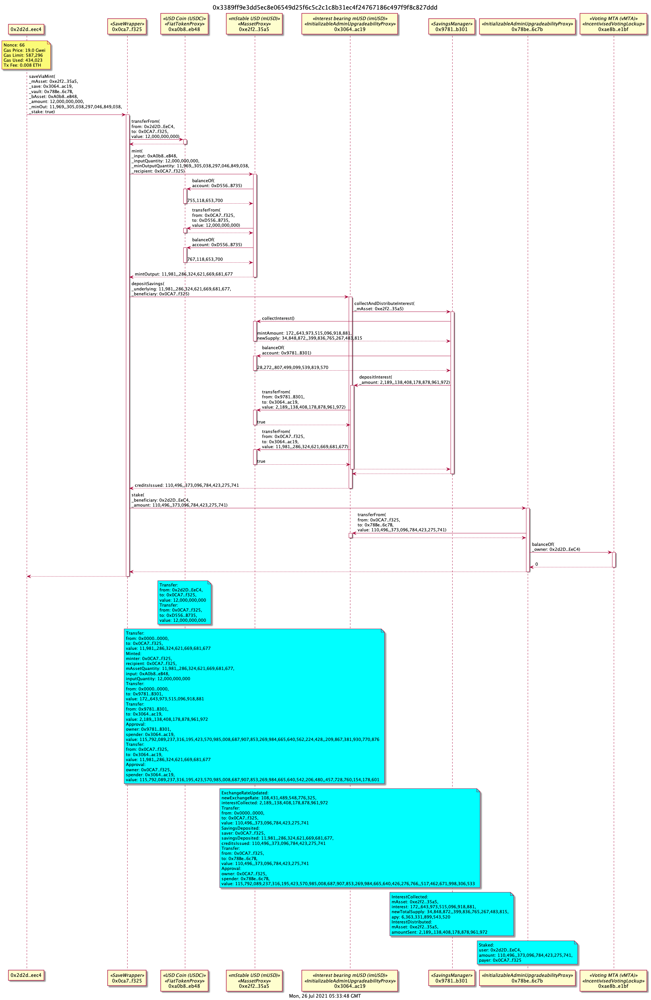

# mAsset Save Wrapper

[SaveWapper](https://etherscan.io/address/0x0ca7a25181fc991e3cc62bac511e62973991f325#code) contract to facilitate deposits into the saving contract (imUSD) or imUSD Vault (v-imUSD).

## Save to imUSD Vault using USDC

Mint mUSD from USDC, deposit mUSD to savings contract (imUSD) and stake imUSD to imUSD Vault (v-mUSD).



Generated from
```tx2uml -x -v -g -a 0xca480d596e6717c95a62a4dc1bd4fbd7b7e7d705,0xafce80b19a8ce13dec0739a1aab7a028d6845eb3 -f svg 0x3389ff9e3dd5ec8e06549d25f6c5c2c1c8b31ec4f24767186c497f9f8c827ddd -o saveViaMintVault```

