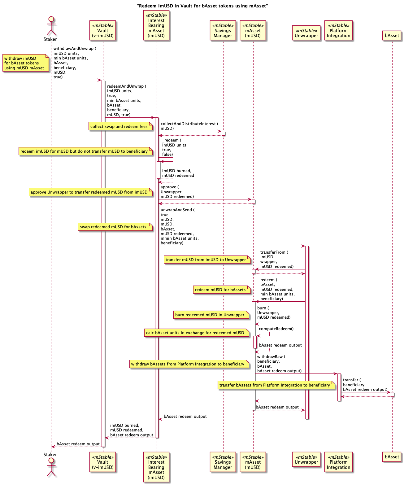
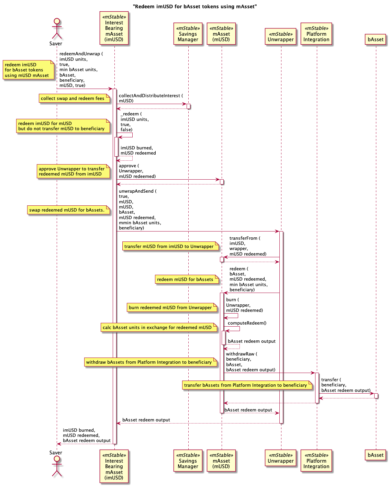
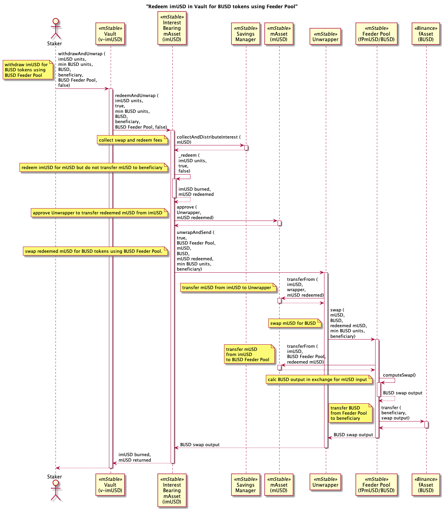
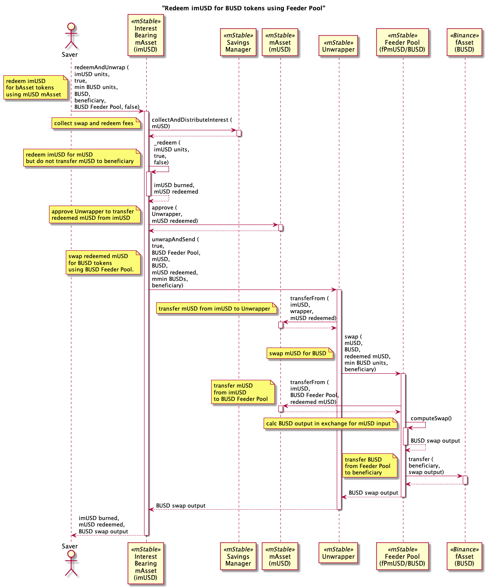

# Unwrapper

Processes for `Unwrapper` contract that off-boards stakers in vaults or savers in interest-bearing assets to a base asset (bAsset) or feeder pool asset (fAsset).

## Staker Redeem imUSD in Vault for bAsset tokens using mAsset

## Saver Redeem imUSD for bAsset tokens using mAsset

## Staker Redeem imUSD in Vault for BUSD tokens using Feeder Pool

## Saver Redeem imUSD for BUSD tokens using Feeder Pool

