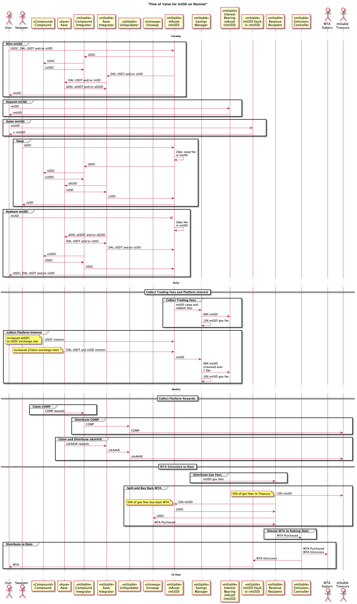
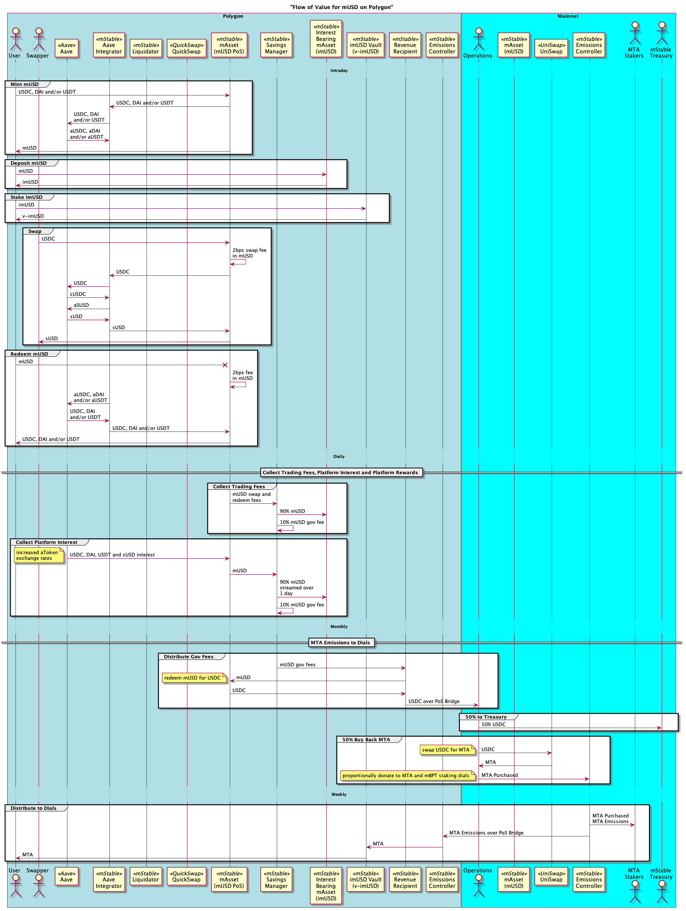

# Value Flows

The high level flow of value (tokens) between contracts and chains. The arrows are the movement of tokens (value) and not contract calls like the other sequence diagrams in this repository.

## Mainnet mUSD

## Polygon mUSD

